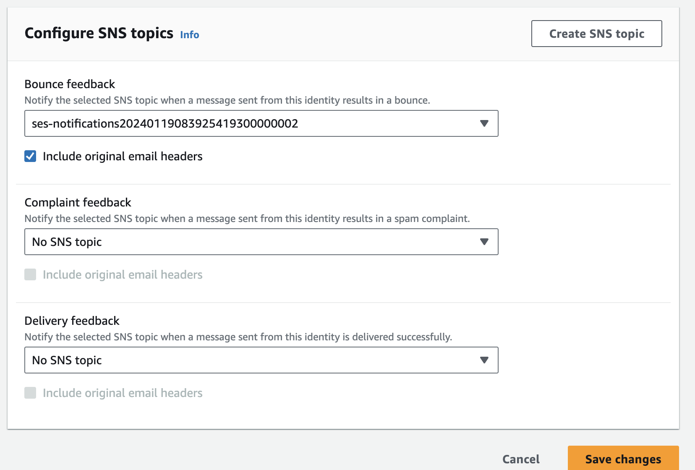
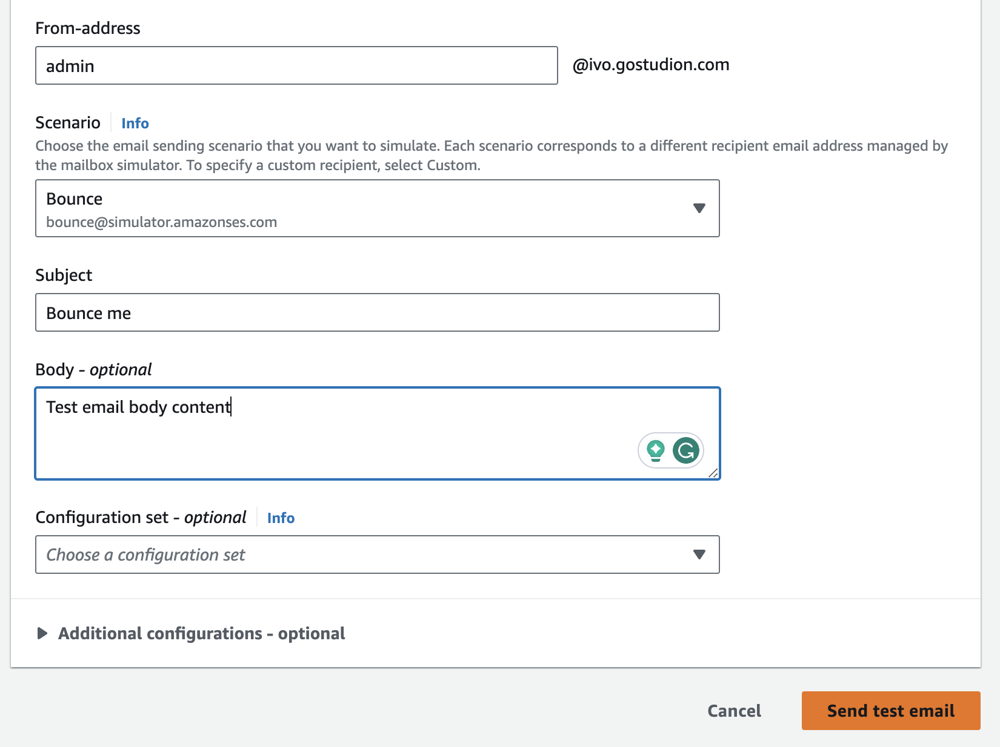

# SES Bounce Handling

## Getting started

1. Install dependencies

```bash
npm i
```

2. Setup the email for receiving SES bounce notifications.

```bash
pulumi config set email my-email@example.org
```

3. Deploy infrastructure with Pulumi

```bash
pulumi up -y
```

4. Use a newly created SNS topic for sending SES notifications

   Navigate to the AWS console -> SES service -> Verified identities -> Select your identity -> Notifications tab -> Feedback notifications -> Edit -> Select newly created SNS topic for "Bounce feedback" and click "Save changes"



5. Send test email

   Navigate to your verified email identity and click "Send test email"


